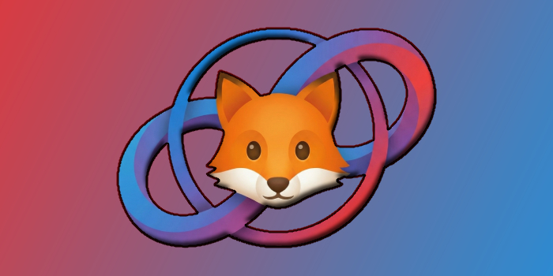

# 🚀 Public Extensions

Welcome to my personal collection of browser extensions (Chrome, Thorium, Brave, Edge, etc.). Here I will publish various tools that are useful for both me and you, ranging from simple tweaks to massive optimizations or completely new designs.

**Why?** Because I got sick of snail-paced websites. 🐌❌

> **Global Status:** 🟢 Active

---

## 🔥 Featured: RUSTIZZED

 

### 🦊 RUSTIZZED AI STUDIO (v3.2)
**A massive overhaul for Google AI Studio!**
It eliminates typing lag, fixes chat rendering issues, applies a new clean aesthetic inspired by foxes (Rusty/Orange theme), and **fixes over 27 console errors** present in the original page.

| Feature | Description |
| :--- | :--- |
| **⚡ Turbo Input** | Toggling this button disables heavy browser processes (spellcheck/suggestions), drastically optimizing typing speed and fluidity! |
| **🎨 Rusty Theme** | Dark theme with high-contrast neon orange accents, applied to both the chat and the UI. |
| **🧠 Smart UI** | User Interface changes: simpler, more compact, and more efficient. |
| **🌍 Multi-language** | Automatically detects English, Spanish, and Portuguese (more might be added later). |
| **🚧 Active Development** | Many things still need improvement, so your feedback and contributions are appreciated! |

[**📥 Go to Releases (Download)**](../../releases)

---

## 📂 Extensions Catalog

Here you will find all the extensions available in this repository.

| Icon | Name | Description | Version | Status |
| :---: | :--- | :--- | :---: | :---: |
| 🦊 | **RUSTIZZED AI STUDIO** | Extreme optimization and redesign for Google AI Studio. | `v3.2` | 🟢 Stable |
| 🔧 | **RACCONIZED TUBE** | *New tool to improve video experience.* | `---` | 🟡 WIP |
| 🧩 | **Coming Soon...** | *More useful utilities on the way.* | `---` | ⚪ Planned |

---

## 📦 How to Install (Developer Mode)

Since these are personal projects, they are installed manually ("Sideloading") to ensure you always have the latest version without restrictions.

1. **Go to Releases:**
   - Look to the right of this GitHub page where it says **Releases**.
   - Click on the latest version (e.g., `v3.2`).
   - Download the `.crx` file (or the source `.zip` if you prefer).

2. **Prepare the Browser:**
   - Open your browser (Chrome/Thorium/Brave/Edge).
   - Type and go to: `chrome://extensions`
   - Toggle the **"Developer mode"** switch (usually top right).

3. **Load the Extension:**
   - **Easy Option:** Drag and drop the downloaded `.crx` file directly into the extensions window.
   - **Source Option:** If you downloaded the source code, unzip it and use the "Load unpacked" button.
   - **Done!** You should see the icon in your toolbar.

---

## 🛠️ Built With:

---

## 📜 License & Usage Terms

**Copyright © 2025 CZeta415. All Rights Reserved.**

This project is free to use for personal purposes, but it is **not** open source.

### You are allowed to:
- ✅ **Download and Use:** Install the extension on your personal devices.
- ✅ **Modify Locally:** Edit the code on your own machine for personal improvements or learning (e.g., changing colors, tweaking speed).
- ✅ **Study:** View the source code to understand how it works.

### You are NOT allowed to:
- ⛔ **Distribute:** Re-upload this project (modified or unmodified) to other repositories, extensions stores, or websites.
- ⛔ **Claim Ownership:** Pass off this work (or modifications of it) as your own creation.
- ⛔ **Sell:** Use this project for any commercial purpose.

If you want to suggest improvements or fix bugs, please open a **Pull Request** or an **Issue** in this repository instead of distributing a separate version.
